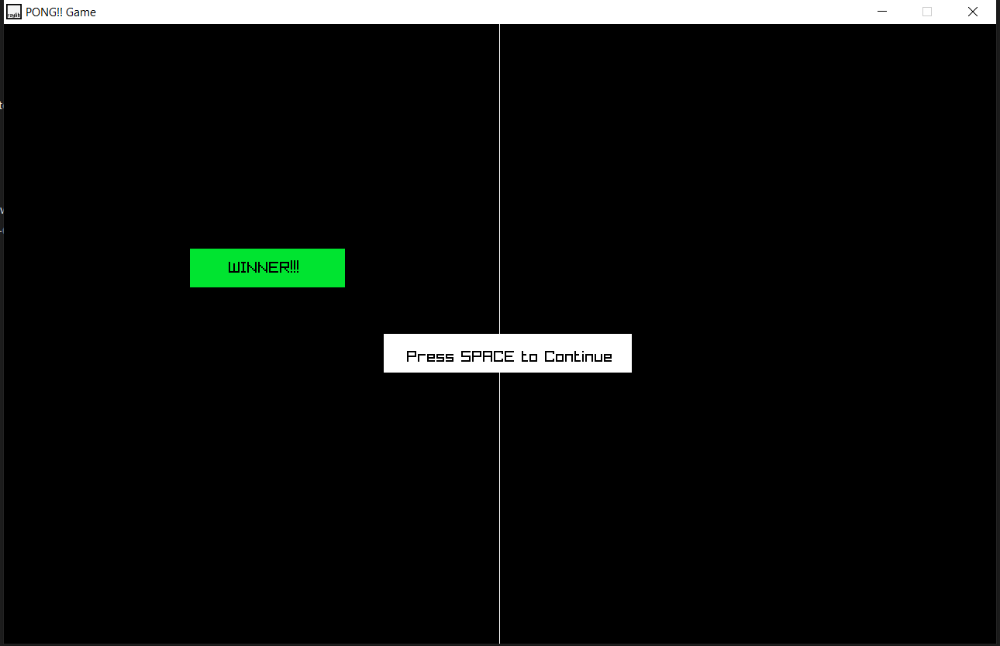

# PONG Game

A Game made using c++ and Raylib
This demo project contains a bouncing ball raylib example program.

It works with raylib version 4.5.
Tested on both Windows 10 and Windows 11.

# Video Tutorial

  

 
 

  

 
 

  

 
 

  

 
 

